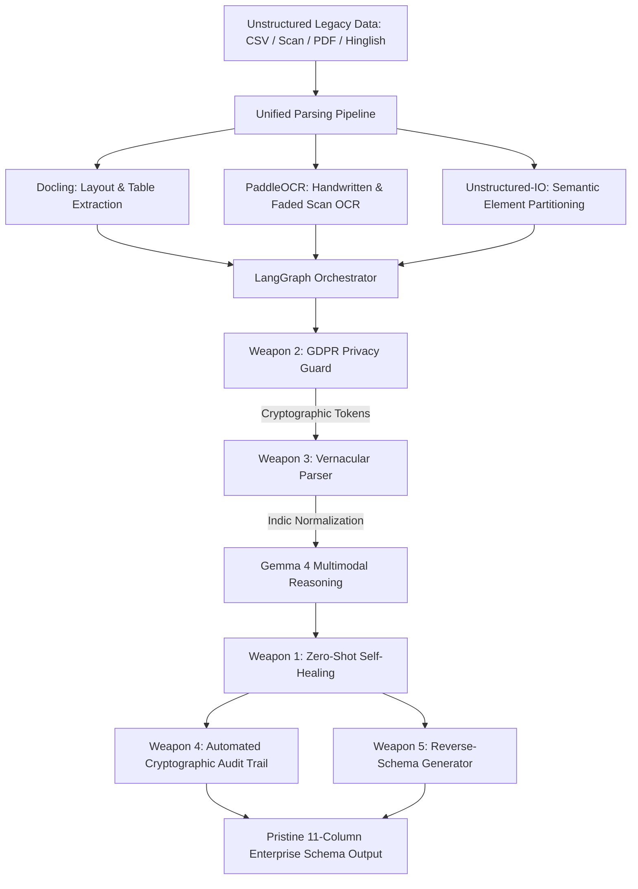

# Recast (Recast-AI) ⚡
### Autonomous Enterprise Data Migration & Smart Parsing Agent

> **Recast** is an award-winning autonomous enterprise agent that ingests messy, unstructured legacy data (chaotic 1-line addresses, degraded OCR scans, Hinglish street slangs, missing postal codes) and intelligently normalizes it into a standardized **11-Column Enterprise Schema** using an open-source multimodal pipeline (**LangGraph**, **Docling**, **PaddleOCR**, **Unstructured**, and **Gemma 4**).

---

## 🌟 Visual Showcase & Hero Centerpiece
The hero section integrates the **`<ThreeDPaper variant="original" />`** component from `@designcodeio/threeui` (`@designcodeio/threeui/style.css`), featuring a custom **Three.js r149 WebGL procedural glass shader** with real-time caustics, chromatic dispersion, interactive cursor wave deformation, and clean container framing (`shader-frame`).

---

## 🛠️ Open-Source Tech Stack & Architecture



### 1. Document Extraction & OCR
- **Docling (`docling-project/docling`)**: Deep structural layout analysis and tabular data extraction.
- **PaddleOCR (`PaddlePaddle/PaddleOCR`)**: Deciphers low-resolution scanned forms, faded thermal receipts, and handwritten KYC notes.
- **Unstructured (`Unstructured-IO/unstructured`)**: Partitions legacy documents into semantic narrative and address chunks.

### 2. Autonomous Agent Orchestration & Multimodal Reasoning
- **LangGraph (`langchain-ai/langgraph`)**: Stateful Directed Acyclic Graph (DAG) state machine chaining nodes with immutable cryptographic validation.
- **Gemma 4 / Gemini Multimodal Engine (`google-deepmind/gemma`)**: Contextual intelligence mapping multi-attribute legacy entities to target enterprise columns.

### 3. Frontend & 3D Glass UI
- **Next.js 14+ / 16 (App Router)** & **TypeScript**
- **Tailwind CSS**
- **ThreeUI (`@designcodeio/threeui`)**: `<ThreeDPaper variant="original" />` interactive glass canvas.
- **Lucide Icons**

---

## ⚔️ The 5 Killer Enterprise Weapons

| Weapon | Name | Enterprise Capability |
|---|---|---|
| **Weapon 1** | **Zero-Shot Self-Healing** | Autonomously predicts and auto-fills missing fields (e.g. missing postal codes, states, country codes) using geospatial heuristics with a visible **Confidence Score badge**. |
| **Weapon 2** | **GDPR Privacy Guard** | On-the-fly PII masking replacing sensitive names, phone numbers, and tax IDs with cryptographic tokens (`[ENC_NAME_...]`) before cloud LLM ingestion, with authorized reveal/export. |
| **Weapon 3** | **Vernacular Parser** | Seamlessly decodes Hinglish colloquialisms, regional city aliases (*Dilli* $\to$ *Delhi*, *Bombay* $\to$ *Mumbai*), and landmark idioms (*peeli kothi*, *opp Sharma sweets*). |
| **Weapon 4** | **Automated Audit Trail** | Produces a live cryptographic lineage with chained SHA-256 state hashes compliant with **ISO 27001**, **SOC 2 Type II**, and **GDPR Article 32**. |
| **Weapon 5** | **Reverse-Schema Generator** | Instantly generates **PostgreSQL DDL**, **Prisma ORM schema**, **Pydantic v2 models**, and **TypeScript interfaces** directly from the parsed legacy schema. |

---

## 📊 The Standard 11-Column Enterprise Schema

1. `record_id`: Deterministic enterprise identifier (`REC-2026-XXXX`)
2. `entity_type`: Classification (`INDIVIDUAL` \| `ENTERPRISE` \| `VENDOR` \| `LOGISTICS_HUB`)
3. `full_name_clean`: Sanitized, title-cased corporate or personal name
4. `tax_id`: Validated PAN / GSTIN / TIN / Tax Identifier
5. `address_line1`: Primary premise info (Door, Building, Street, Gali)
6. `address_line2`: Secondary locality info (Sector, Landmark, Mohalla)
7. `city`: Official normalized city name
8. `state_province`: Standardized state or province
9. `postal_code`: Validated 6-digit postal code (**Self-Healed** if missing)
10. `contact_normalized`: E.164 phone (+91...) and clean email
11. `confidence_score`: Multimodal AI parse confidence rating (0.00 to 1.00)

---

## 📂 Exact File Tree Created

```
RecastAI/
├── agent.json                          # Open-Source Agent Skill Standard Spec
├── README.md                           # System architecture & deployment docs
├── backend/                            # Python FastAPI Backend
│   ├── requirements.txt                # Python dependencies
│   ├── run.py                          # Backend launcher
│   ├── .venv/                          # Virtual environment
│   └── app/
│       ├── __init__.py
│       ├── main.py                     # FastAPI routes & endpoints (/api/parse, /api/health)
│       ├── config.py                   # Environment & model configuration
│       ├── models/
│       │   ├── schema.py               # 11-column schema & audit Pydantic models
│       │   └── requests.py             # API request/response definitions
│       ├── agent/
│       │   ├── orchestrator.py         # LangGraph workflow state machine
│       │   ├── gemma_engine.py         # Multimodal reasoning engine (Gemma 4 / Gemini)
│       │   └── weapons/
│       │       ├── self_healing.py     # Weapon 1: Zero-Shot Self-Healing
│       │       ├── privacy_guard.py    # Weapon 2: GDPR Privacy Guard
│       │       ├── vernacular.py       # Weapon 3: Vernacular Hinglish Parser
│       │       ├── audit_trail.py      # Weapon 4: Automated Cryptographic Audit Trail
│       │       └── reverse_schema.py   # Weapon 5: Reverse-Schema Generator
│       ├── parsers/
│       │   ├── docling_parser.py       # Docling layout & table extractor
│       │   ├── paddle_parser.py        # PaddleOCR scan & noise cleanser
│       │   ├── unstructured_parser.py  # Unstructured chunk partitioner
│       │   └── pipeline.py             # Unified parsing pipeline
│       └── samples/
│           └── legacy_datasets.py      # Realistic enterprise legacy test cases
└── frontend/                           # Next.js 14+/16 App Router Frontend
    ├── package.json
    ├── tsconfig.json
    ├── tailwind.config.ts
    └── src/
        ├── app/
        │   ├── layout.tsx              # SEO metadata & dark theme wrapper
        │   ├── page.tsx                # Recast Enterprise Migration Dashboard
        │   ├── globals.css             # Glassmorphism & .shader-frame CSS
        │   └── api/recast/route.ts     # Next.js proxy route with isomorphic fallback
        ├── components/
        │   ├── hero/
        │   │   ├── ThreeDPaper.tsx     # <ThreeDPaper variant="original" /> ThreeUI integration
        │   │   └── HeroHeader.tsx      # Enterprise top nav & status pills
        │   ├── control/
        │   │   ├── IngestionPanel.tsx  # Dropzone, sample selector & 5 weapons toggles
        │   │   └── ExecutionTerminal.tsx # Live streaming terminal logs
        │   └── studio/
        │       ├── ComparisonTable.tsx # 11-column Before/After table with confidence badges
        │       ├── AuditTrailView.tsx  # Cryptographic SHA-256 lineage viewer
        │       ├── ReverseSchemaView.tsx # Interactive SQL / Prisma / Pydantic generator
        │       └── AgentSpecModal.tsx  # agent.json Open Standard viewer
        └── lib/
            ├── types.ts                # TypeScript types & interfaces
            ├── samples.ts              # Preset enterprise legacy test cases
            └── recastClient.ts         # Unified API client helper
```

---

## 🚀 Startup Instructions

### 1. Prerequisites
- **Node.js**: v18+ (tested on Node v24)
- **Python**: 3.11+ (managed via `uv` or standard Python virtual environment)

### 2. Backend Startup (Python / FastAPI)
```bash
cd backend

# Option A: With the installed virtual environment
.\.venv\Scripts\python.exe run.py

# Option B: Standard Python
python -m venv .venv
.\.venv\Scripts\activate
pip install -r requirements.txt
python run.py
```
> The backend server starts on **`http://localhost:8001`**. Verify with:
> `curl http://localhost:8001/api/health`

### 3. Frontend Startup (Next.js / ThreeUI)
```bash
cd frontend

# Install dependencies (already prepared)
npm install

# Start development server
npm run dev -- -p 3001
```
> The dashboard will be accessible at **`http://localhost:3001`**.

---

## 📜 Agent Skill Open Standard Compliance
Recast includes a root-level **`agent.json`** complying with the **Agent Skill Open Standard**, enabling autonomous execution by enterprise CI/CD systems, LangGraph agent hubs, and agentic workflows. Click the **`agent.json`** button in the top navigation to view the live schema specification.
