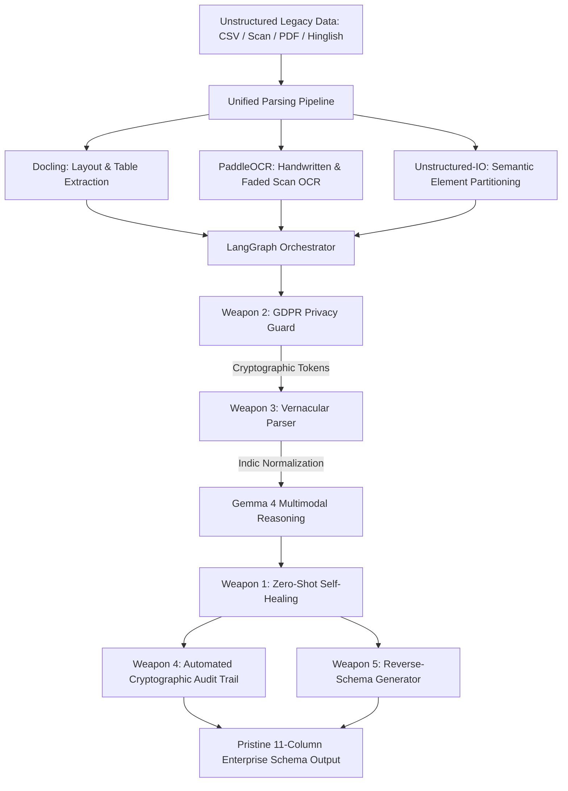

# Recast (Recast-AI) ⚡
### Autonomous Enterprise Data Migration & Smart Parsing Agent

> **Recast** is an autonomous enterprise agent that ingests messy, unstructured legacy data (chaotic 1-line addresses, degraded OCR scans, Hinglish street slangs, missing postal codes) and intelligently normalizes it into a standardized **11-Column Enterprise Schema** using an open-source multimodal pipeline (**LangGraph**, **Docling**, **PaddleOCR**, **Unstructured**, and **Gemma 4**).

🌐 **Live Deployed App**: [https://recast-ai.embarko.app](https://recast-ai.embarko.app)  
📦 **GitHub Repository**: [https://github.com/kavyashrivastava95-oss/Recast.AI](https://github.com/kavyashrivastava95-oss/Recast.AI)

---

## 🎨 Dual-Mode UI Experience (Pure Light Mode & Archival Aesthetic)

Recast features a refined **Pure Light Mode** with an **archival editorial and ledger aesthetic** (warm parchment canvas `#fbf9f4`, crisp matte white cards with fine borders `border-stone-200`, deep charcoal ink `#1c1917`, warm sepia metadata `#78716c`, terracotta/amber accents `#9a3412` and `#b45309`).

### 1. Simple Mode (`default` for General Users)
- **Distraction-Free**: Hides dense developer metrics, raw JSON specs, heavy latency counters, cryptographic hashes, and complex step logs.
- **Prominent File Drop Zone**: Welcoming drag-and-drop zone accepting CSV, TXT, PDF, and OCR scan files with 1-click enterprise sample presets.
- **Single Primary 'Recast My Data' Button**: Prominent execution button with animated loading states.
- **Straightforward Progress Indicator**: Clean 3-step pipeline tracker (*1. Reading layout & OCR* → *2. AI entity cleansing* → *3. Self-healing missing PINs*).
- **Clean Results View**: Searchable 11-column pure data grid, instant CSV & JSON export buttons, and Before vs. After comparison cards.

### 2. Advanced Mode (for Power Users & Developers)
- **Collapsible Admin Sidebar**: Navigation modules, active weapons group, and verified **99.4% SLA** status.
- **Executive KPI Cards**: Real-time cards for *Clean Records*, *Self-Healing Resolution*, *Pipeline DAG Latency*, and *Cryptographic Chain Integrity*.
- **Live Agent Execution Terminal**: Archival streaming terminal with millisecond latency badges and LangGraph DAG step highlights.
- **Cryptographic Audit Trail**: ISO 27001 / GDPR Art. 32 verification registry with chained SHA-256 state hashes.
- **Reverse-Schema Generator**: Generates production-grade PostgreSQL DDL, Prisma ORM schema, Pydantic v2 models, and TypeScript interfaces.
- **Open Standard `agent.json`**: Integrated specification dossier modal.

---

## 🌟 Visual Showcase & Hero Centerpiece
The hero section integrates the **`<ThreeDPaper variant="original" />`** component from `@designcodeio/threeui` (`@designcodeio/threeui/style.css`), featuring a custom **Three.js r149 WebGL procedural vellum paper shader** with real-time micro-mesh paper grain, satin luster, interactive cursor tension deformation, and clean container framing (`shader-frame`).

---

## 🛠️ Open-Source Tech Stack & Architecture



### 1. Document Extraction & OCR
- **Docling (`docling-project/docling`)**: Deep structural layout analysis and tabular data extraction.
- **PaddleOCR (`PaddlePaddle/PaddleOCR`)**: Deciphers low-resolution scanned forms, faded thermal receipts, and handwritten KYC notes.
- **Unstructured (`Unstructured-IO/unstructured`)**: Partitions legacy documents into semantic narrative and address chunks.

### 2. Autonomous Agent Orchestration & Multimodal Reasoning
- **LangGraph (`langchain-ai/langgraph`)**: Stateful Directed Acyclic Graph (DAG) state machine chaining nodes with immutable cryptographic validation.
- **Gemma 4 / Gemini Multimodal Engine (`google-deepmind/gemma`)**: Contextual intelligence mapping multi-attribute legacy entities to target enterprise columns.

### 3. Frontend & Shadcn UI
- **Next.js 14+ / 16 (App Router)** & **TypeScript**
- **Tailwind CSS v4** & **Shadcn UI Kit**
- **ThreeUI (`@designcodeio/threeui`)**: `<ThreeDPaper variant="original" />` interactive parchment canvas.
- **Lucide Icons**

---

## ⚔️ The 5 Killer Enterprise Weapons

| Weapon | Name | Enterprise Capability |
|---|---|---|
| **Weapon 1** | **Zero-Shot Self-Healing** | Autonomously predicts and auto-fills missing fields (e.g. missing postal codes, states, country codes) using geospatial heuristics with a visible **Confidence Score badge**. |
| **Weapon 2** | **GDPR Privacy Guard** | On-the-fly PII masking replacing sensitive names, phone numbers, and tax IDs with cryptographic tokens (`[ENC_NAME_...]`) before cloud LLM ingestion, with authorized reveal/export. |
| **Weapon 3** | **Vernacular Parser** | Seamlessly decodes Hinglish colloquialisms, regional city aliases (*Dilli* $\to$ *Delhi*, *Bombay* $\to$ *Mumbai*), and landmark idioms (*peeli kothi*, *opp Sharma sweets*). |
| **Weapon 4** | **Automated Audit Trail** | Produces a live cryptographic lineage with chained SHA-256 state hashes compliant with **ISO 27001**, **SOC 2 Type II**, and **GDPR Article 32**. |
| **Weapon 5** | **Reverse-Schema Generator** | Instantly generates **PostgreSQL DDL**, **Prisma ORM schema**, **Pydantic v2 models**, and **TypeScript interfaces** directly from the parsed legacy schema. |

---

## 🏛️ Standardized 11-Column Pure Schema

| Column Index | Field Name | Type | Description |
|---|---|---|---|
| **Col 1** | `record_id` | `VARCHAR(64)` | Deterministic enterprise identifier (`REC-YYYY-XXXX`) |
| **Col 2** | `entity_type` | `ENUM` | Entity classification (`ENTERPRISE`, `INDIVIDUAL`, `VENDOR`, `LOGISTICS_HUB`) |
| **Col 3** | `full_name_clean` | `VARCHAR(255)` | Normalized title-cased corporate or individual name |
| **Col 4** | `tax_id` | `VARCHAR(64)` | Validated GSTIN, PAN, or Tax ID |
| **Col 5** | `address_line1` | `TEXT` | Door, flat, building, shop, premise, and street |
| **Col 6** | `address_line2` | `TEXT` | Locality, sector, area, and landmark |
| **Col 7** | `city` | `VARCHAR(128)` | Standardized municipal city or district |
| **Col 8** | `state_province` | `VARCHAR(128)` | State / province (*self-healed if missing*) |
| **Col 9** | `postal_code` | `VARCHAR(32)` | 6-digit PIN code (*predicted via geospatial context if missing*) |
| **Col 10** | `contact_normalized` | `VARCHAR(128)` | E.164 phone (+91...) and sanitized email address |
| **Col 11** | `confidence_score` | `NUMERIC(4,3)` | Multimodal AI confidence rating (0.00 to 1.00) with badge |

---

## 🚀 Deployment Instructions

### Option 1: Vercel (Monorepo Deployment)
Deploy both servers independently from the same GitHub repository:
1. **Frontend**: New Project on Vercel → Root Directory: `frontend` → Preset: `Next.js`.
2. **Backend**: New Project on Vercel → Root Directory: `backend` → Preset: `Other`.

### Option 2: Embarko
```bash
tar -czf /tmp/app.tar.gz --exclude=node_modules --exclude=.next --exclude=.git -C frontend .
curl -X POST "https://ship.embarko.ai/apps" \
  -H "X-App-Name: recast-ai" \
  -H "X-App-Type: developer-tools" \
  -H "X-Agent-Name: antigravity" \
  -F "source=@/tmp/app.tar.gz"
```

---

## 📜 Agent Skill Open Standard Compliance
Recast includes a root-level **`agent.json`** complying with the **Agent Skill Open Standard**, enabling autonomous execution by enterprise CI/CD systems, LangGraph agent hubs, and agentic workflows.
